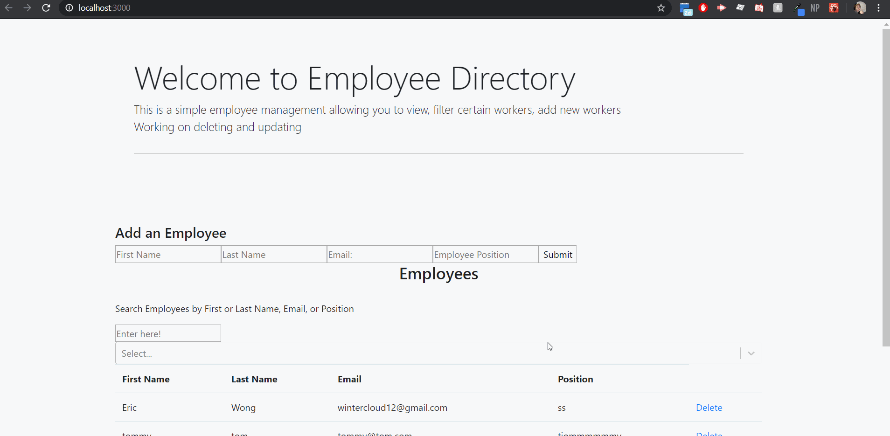

# Employee Directory

# Disclaimer
This application was the first MERN (MongoDB, Express, React, NodeJS) application i've created. The application has numerous bugs and incompleted functionalities.  
Some being the delete function for removing employees, have the drop box for select to show the proper roles or employees,properly connecting the backend to the front end, and overall the React side clarification (being wording and making things more DRY).

<a href = "https://github.com/Ericcwong/Employee-Directory"> Github</a> Link   
<a href ="https://ericcwong-employee-directory.herokuapp.com/"> Heroku</a> Link

# Purpose
Employee Directory is an application that allows the manager manage their staff. You are able to add new staff to the current roaster and or find quick information about current employees.

# Application's Software and languages

<ul>
<li>MongoDB</li>
<li>Express</li>
<li>React</li>
<li>NodeJs</li>
<li>PostMan</li> with figuring out api routing
</ul>

# Improvements for future developements

Learning React would of been the first step. I thought I had the grasp of it enought to combine the application with the backend. I was wrong, I need to spend more time with just placing and setting the state. That would of made this whole process of coding this application far easier. I wish I could of spent mroe time onto this project to polish out the sharp corners and imperfections.

# Resources
<a href ="https://www.youtube.com/watch?v=7CqJlxBYj-M&t=1287s" >Youtube video: FreecodeCamp.org</a> I followed their tutorial to get the feel and understanding of a MERN stack. I was able to learn how to connect the backend and the frontend with axios.
  
I also watch a handful of other videos and stackoverflow articles to figure out some bugs.# Employee-Directory2.0
# Employee-Directory2.0
